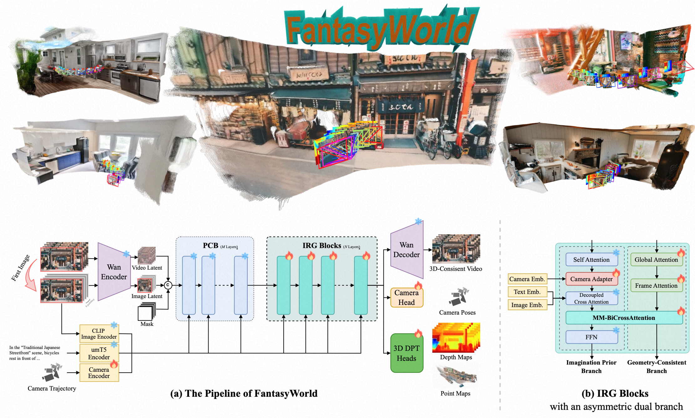

[中文阅读](./README_zh.md)
# FantasyWorld: Geometry-Consistent World Modeling via Unified Video and 3D Prediction


[](https://fantasy-amap.github.io/fantasy-world/)
[](https://arxiv.org/abs/2509.21657)
[](https://github.com/Fantasy-AMAP/fantasy-world.git)
[](https://huggingface.co/acvlab/FantasyWorld-Wan2.1-I2V-14B-480P)
[](https://huggingface.co/acvlab/FantasyWorld-Wan2.2-Fun-A14B-Control-Camera)
[](https://modelscope.cn/amap_cvlab/FantasyWorld-Wan2.1-I2V-14B-480P)
[](https://modelscope.cn/amap_cvlab/FantasyWorld-Wan2.2-Fun-A14B-Control-Camera)


## 🔥🔥🔥 Latest News
- 👋 Feb, 2026: We release the code and model weights of FantasyWorld.
- 🏛 Jan, 2026: FantasyWorld is accepted by **ICLR 2026**.
- 🎉 Dec, 2025: FantasyWorld ranked **1st** on the [WorldScore](https://huggingface.co/spaces/Howieeeee/WorldScore_Leaderboard) Leaderboard (by Stanford Prof. Fei-Fei Li's Team), validating our approach against global state-of-the-art models.

## 🌟 Overview



FantasyWorld is a unified feed-forward model for joint video and 3D scene generation. The front end employs Preconditioning Blocks (PCBs) that reuse the frozen WanDiT denoiser to supply partially denoised latents, ensuring the geometry pathway operates on meaningful features rather than pure noise. The backbone then consists of stacked Integrated Reconstruction and Generation (IRG) Blocks, which iteratively refine video latents and geometry features under multimodal conditioning. Each IRG block contains an asymmetric dual-branch structure: an Imagination Prior Branch for appearance synthesis and a Geometry-Consistent Branch for explicit 3D reasoning, coupled through lightweight adapters and cross attention.

### 🚀 Training Strategy

FantasyWorld leverages a robust **two-stage training strategy** to achieve jointly video and 3D generation:

- **Stage 1 (Geometry Pre-training):** Utilizes a VGGT-style model for precise estimation of depth, point, and camera trajectories.
- **Stage 2 (Joint Generation):** A unified model that seamlessly integrates the Stage 1 geometry backbone with the Wan video generation pipeline.

### 📦 Model Zoo

We provide two versions of the model to cater to different research and application needs:

| Model Name | Description |
| :--- | :--- |
| `FantasyWorld-Wan2.1-I2V-14B-480P` | **Reproducibility Focus:** Strictly adheres to the original configurations detailed in our paper. Best for academic benchmarking and reproducing reported results. |
| `FantasyWorld-Wan2.2-Fun-A14B-Control-Camera` | **Performance Focus:** Offers substantial enhancements, including an upgraded video foundation model, larger-scale training datasets, and higher output resolution. |


## 🚀 Quickstart

### Installation

1. **Clone the repository**
```bash
git clone https://github.com/Fantasy-AMAP/fantasy-world.git
cd fantasy-world
```

2. **Install dependencies**

```bash
conda create -n fantasyworld python=3.10
conda activate fantasyworld
pip install -r requirements.txt
pip install thirdparty/utils3d/
```
### 1. FantasyWorld-Wan2.1-I2V-14B-480P

#### 1.1 Model Download
| Models        |                       Download Link                                           |    Notes                      |
| --------------|-------------------------------------------------------------------------------|-------------------------------|
| Wan2.1-I2V-14B-480P  |      🤗 [Huggingface](https://huggingface.co/Wan-AI/Wan2.1-I2V-14B-480P)    🤖 [ModelScope](https://www.modelscope.cn/models/Wan-AI/Wan2.1-I2V-14B-480P)     | Base Model
| FantasyWorld-Wan2.1-I2V-14B-480P      |   🤗 [Huggingface](https://huggingface.co/acvlab/FantasyWorld-Wan2.1-I2V-14B-480P)    🤖 [ModelScope](https://www.modelscope.cn/models/amap_cvlab/FantasyWorld-Wan2.1-I2V-14B-480P)    | FantasyWorld

Download models using `huggingface`:
```bash
pip install -U "huggingface_hub"
hf download "Wan-AI/Wan2.1-I2V-14B-480P" --local-dir ./models/Wan-AI/Wan2.1-I2V-14B-480P
hf download "acvlab/FantasyWorld-Wan2.1-I2V-14B-480P" --local-dir ./models/FantasyWorld-Wan2.1-I2V-14B-480P/
```

Download models using `modelscope`:
```bash
pip install -U modelscope
modelscope download "Wan-AI/Wan2.1-I2V-14B-480P" --local_dir ./models/Wan-AI/Wan2.1-I2V-14B-480P
modelscope download "amap_cvlab/FantasyWorld-Wan2.1-I2V-14B-480P" --local_dir ./models/FantasyWorld-Wan2.1-I2V-14B-480P/
```

#### 1.2 Inference Command

```bash
python inference_wan21.py \
    --wan_ckpt_path ./models/Wan-AI/Wan2.1-I2V-14B-480P \
    --model_ckpt ./models/FantasyWorld-Wan2.1-I2V-14B-480P/model.pth \
    --image_path ./examples/images/input_image.png \
    --camera_json_path ./examples/cameras/camera_data.json \
    --prompt "In the Open Loft Living Room, sunlight streams through large windows, highlighting the sleek fireplace and elegant wooden stairs." \
    --output_dir ./output-wan21 \
    --sample_steps 50 \
    --using_scale True 
```

**Parameter Description:**
- `--wan_ckpt_path` - **Required**: Directory containing the Wan model checkpoints
- `--model_ckpt` - **Required**: Path to the trained model checkpoint
- `--image_path` - **Required**: Path to the input image
- `--camera_json_path` - **Required**: Camera json path
- `--prompt` - **Required**: Text prompt
- `--output_dir` - **Optional**: Output directory 
- `--sample_steps` - **Optional**: Number of sampling steps (default: 50)
- `--using_scale` - **Optional**: Whether to use scale normalization (default: True)

### 2. FantasyWorld-Wan2.2-Fun-A14B-Control-Camera

#### 2.1 Model Download
| Models        |                       Download Link                                           |    Notes                      |
| --------------|-------------------------------------------------------------------------------|-------------------------------|
| Wan2.2-Fun-A14B-Control-Camera  |      🤗 [Huggingface](https://huggingface.co/alibaba-pai/Wan2.2-Fun-A14B-Control-Camera)    🤖 [ModelScope](https://www.modelscope.ai/models/PAI/Wan2.2-Fun-A14B-Control-Camera)     | Base Model
| Wan2.2-Fun-Reward-LoRAs      |   🤗 [Huggingface](https://huggingface.co/alibaba-pai/Wan2.2-Fun-Reward-LoRAs)    🤖 [ModelScope](https://www.modelscope.ai/models/PAI/Wan2.2-Fun-Reward-LoRAs)    | LoRA Model
| FantasyWorld-Wan2.2-Fun-A14B-Control-Camera      |   🤗 [Huggingface](https://huggingface.co/acvlab/FantasyWorld-Wan2.2-Fun-A14B-Control-Camera)   🤖 [ModelScope](https://www.modelscope.ai/models/amap_cvlab/FantasyWorld-Wan2.2-Fun-A14B-Control-Camera)    | FantasyWorld

Download models using `huggingface`:
```bash
pip install -U "huggingface_hub"
hf download "alibaba-pai/Wan2.2-Fun-A14B-Control-Camera" --local-dir ./models/PAI/Wan2.2-Fun-A14B-Control-Camera
hf download "alibaba-pai/Wan2.2-Fun-Reward-LoRAs" --local-dir ./models/PAI/Wan2.2-Fun-Reward-LoRAs
hf download "acvlab/FantasyWorld-Wan2.2-Fun-A14B-Control-Camera" --local-dir ./models/FantasyWorld-Wan2.2-Fun-A14B-Control-Camera/
```

Download models using `modelscope`:
```bash
pip install -U modelscope
modelscope download "PAI/Wan2.2-Fun-A14B-Control-Camera" --local_dir ./models/PAI/Wan2.2-Fun-A14B-Control-Camera
modelscope download "PAI/Wan2.2-Fun-Reward-LoRAs" --local_dir ./models/PAI/Wan2.2-Fun-Reward-LoRAs
modelscope download "amap_cvlab/FantasyWorld-Wan2.2-Fun-A14B-Control-Camera" --local_dir ./models/FantasyWorld-Wan2.2-Fun-A14B-Control-Camera/
```

#### 2.2 Inference Command

```bash
python inference_wan22.py \
    --image_path ./examples/images/input_image.png \
    --end_image_path ./examples/images/end_image.png \
    --wan_ckpt_path ./models/ \
    --camera_json_path ./examples/cameras/camera_data.json \
    --prompt "In the Open Loft Living Room, sunlight streams through large windows, highlighting the sleek fireplace and elegant wooden stairs." \
    --model_ckpt_high ./models/FantasyWorld-Wan2.2-Fun-A14B-Control-Camera/high_noise_model.pth \
    --model_ckpt_low ./models/FantasyWorld-Wan2.2-Fun-A14B-Control-Camera/low_noise_model.pth \
    --output_dir ./output-wan22 \
    --sample_steps 50 \
    --using_scale True
```

**Parameter Description:**
- `--image_path` - **Required**: Path to the first image
- `--end_image_path` - **Required**: Path to the end image
- `--wan_ckpt_path` - **Required**: Directory containing the Wan model checkpoints
- `--camera_json_path` - **Required**: Camera json path, corresponding to examples/cameras/camera_data_*.json
- `--prompt` - **Required**: Text prompt
- `--model_ckpt_high` - **Required**: Path to the trained high model checkpoint
- `--model_ckpt_low` - **Required**: Path to the trained low model checkpoint
- `--output_dir` - **Optional**: Output directory 
- `--sample_steps` - **Optional**: Number of sampling steps (default: 50)
- `--using_scale` - **Optional**: Whether to use scale normalization (default: True)

## 🧩 Community Contributions
We ❤️ contributions from the open-source community! If your work has improved FantasyWorld, please inform us.
Or you can directly e-mail [frank.jf@alibaba-inc.com](mailto://frank.jf@alibaba-inc.com). We are happy to reference your project for everyone's convenience.


## 🔗Citation
If you find this repository useful, please consider giving a star ⭐ and citation.
```
@inproceedings{
    dai2025fantasyworld,
    title={FantasyWorld: Geometry-Consistent World Modeling via Unified Video and 3D Prediction},
    author={Yixiang Dai and Fan Jiang and Chiyu Wang and Mu Xu and Yonggang Qi},
    booktitle={The Fourteenth International Conference on Learning Representations},
    year={2026},
    url={https://openreview.net/forum?id=3q9vHEqsNx}
}
```

## 🙏 Acknowledgments

We would like to thank [Wan](https://github.com/Wan-Video), [VideoX-Fun](https://github.com/aigc-apps/VideoX-Fun), [DiffSynth-Studio](https://github.com/modelscope/DiffSynth-Studio) and [VGGT](https://github.com/facebookresearch/vggt.git) for their great works.

